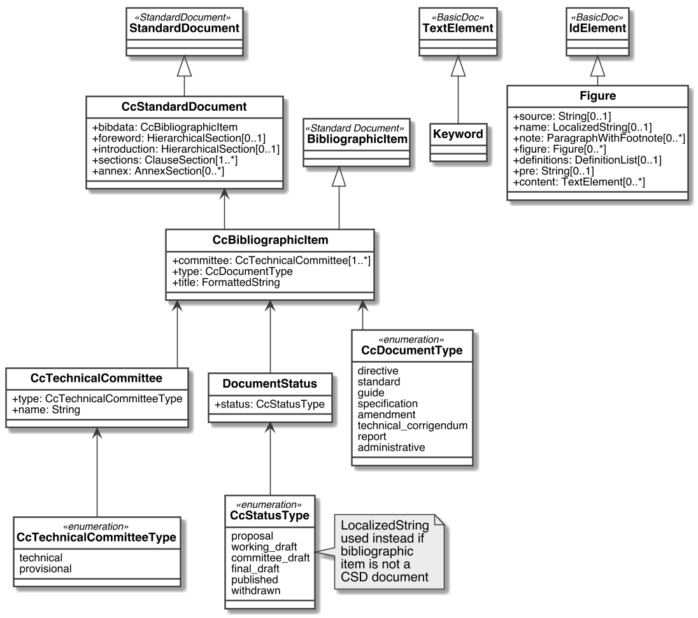

= Metanorma CSD Models

image:https://github.com/metanorma/metanorma-model-csd/workflows/ubuntu/badge.svg["Ubuntu Build Status", link="https://github.com/metanorma/metanorma-model-csd/actions?query=workflow%3Aubuntu"]
image:https://github.com/metanorma/metanorma-model-csd/workflows/macos/badge.svg["OSX Build Status", link="https://github.com/metanorma/metanorma-model-csd/actions?query=workflow%3Amacos"]
image:https://github.com/metanorma/metanorma-model-csd/workflows/windows/badge.svg["Windows Build Status", link="https://github.com/metanorma/metanorma-model-csd/actions?query=workflow%3Awindows"]

This is where we keep the Metanorma CSD model definitions.

The CSD Standard Document format is an instance of the
https://github.com/metanorma/metanorma-model-standoc[Metanorma StandardDocument model].
Details of the general model can be found on its page.

== CSD Standard Document Model

