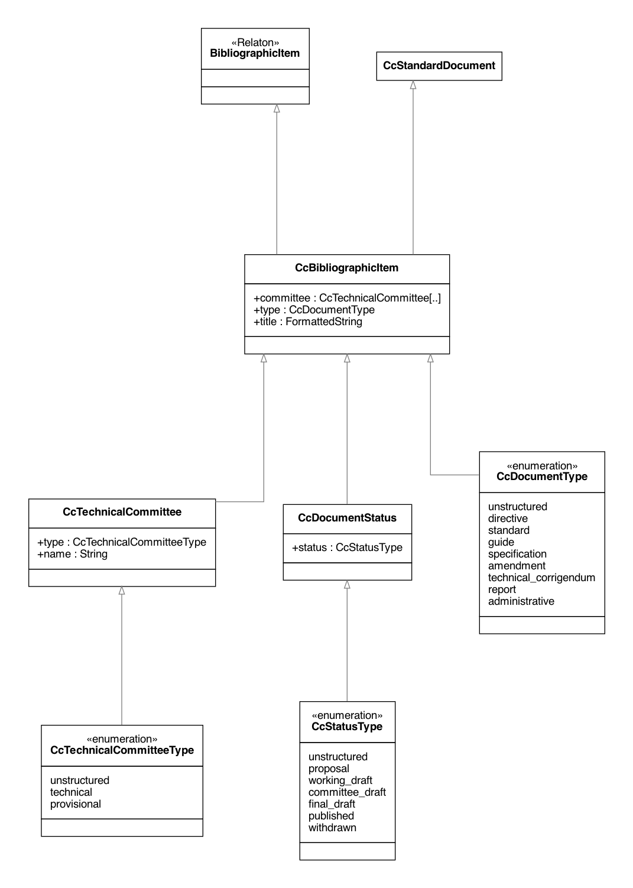

= Metanorma CalConnect Models

image:https://github.com/metanorma/metanorma-model-cc/workflows/make/badge.svg["Build Status", link="https://github.com/metanorma/metanorma-model-cc/actions?workflow=make"]

This is where we keep the Metanorma CalConnect model definitions.

The CalConnect Standard Document format is an instance of the
https://github.com/metanorma/metanorma-model-standoc[Metanorma StandardDocument model].
Details of the general model can be found on its page.

== CalConnect Standard Document Model

=== Document

=== Metadata

=== Elements

